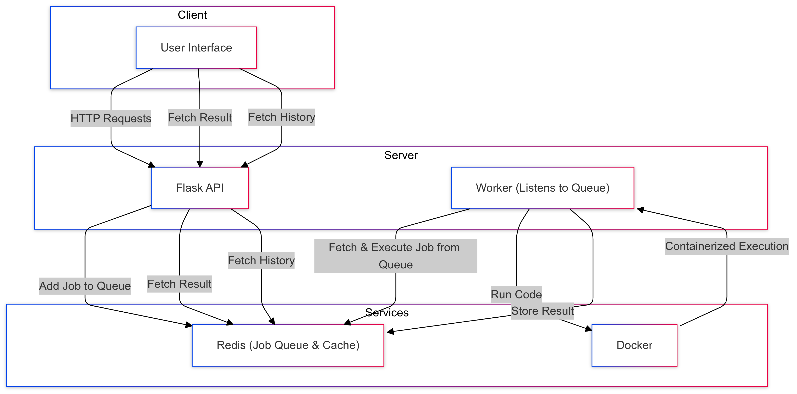

# Code Execution Engine

## Overview

The Code Execution Engine is a web-based application that allows users to write, execute, and view the history of code snippets in various programming languages. The supported languages include Python, JavaScript, Java, and PHP.

## Features

- **Code Execution**: Write and execute code snippets in multiple programming languages.
- **Execution History**: View the history of executed code snippets with their outputs and timestamps.
- **Real-time Updates**: Poll for execution results and display them in real-time.

## Project Structure

- `app/ui/index.html`: The main HTML file for the web interface.
- `app/ui/api_tester.js`: JavaScript file containing the logic for executing code and fetching history.
- `app/ui/styles.css`: CSS file for styling the web interface.
- `README.md`: This file, providing an overview and instructions for the project.

## System Architecture

[](./system_architecture.png)

## Setup

1. **Clone the repository**:
    ```sh
    git clone https://github.com/yourusername/code-execution-engine.git
    cd code-execution-engine
    ```

2. **Build and run the server/worker using Docker Compose**:
    ```sh
    docker-compose up --build -d
    ```

3. **Open the application**:
    Open `http://localhost:5001/` in your web browser.

## Usage

1. **Select a language**: Choose the programming language from the dropdown menu.
2. **Enter code**: Write your code snippet in the provided textarea.
3. **Run code**: Click the "Run Code" button to execute the code.
4. **View results**: The execution result will be displayed in the "Execution Result" section.
5. **View history**: Click the "View Execution History" button to see the history of executed code snippets.

## Contributing

Contributions are welcome! Please fork the repository and submit a pull request with your changes.

## License

This project is licensed under the MIT License. See the `LICENSE` file for details.# code-execution-engine